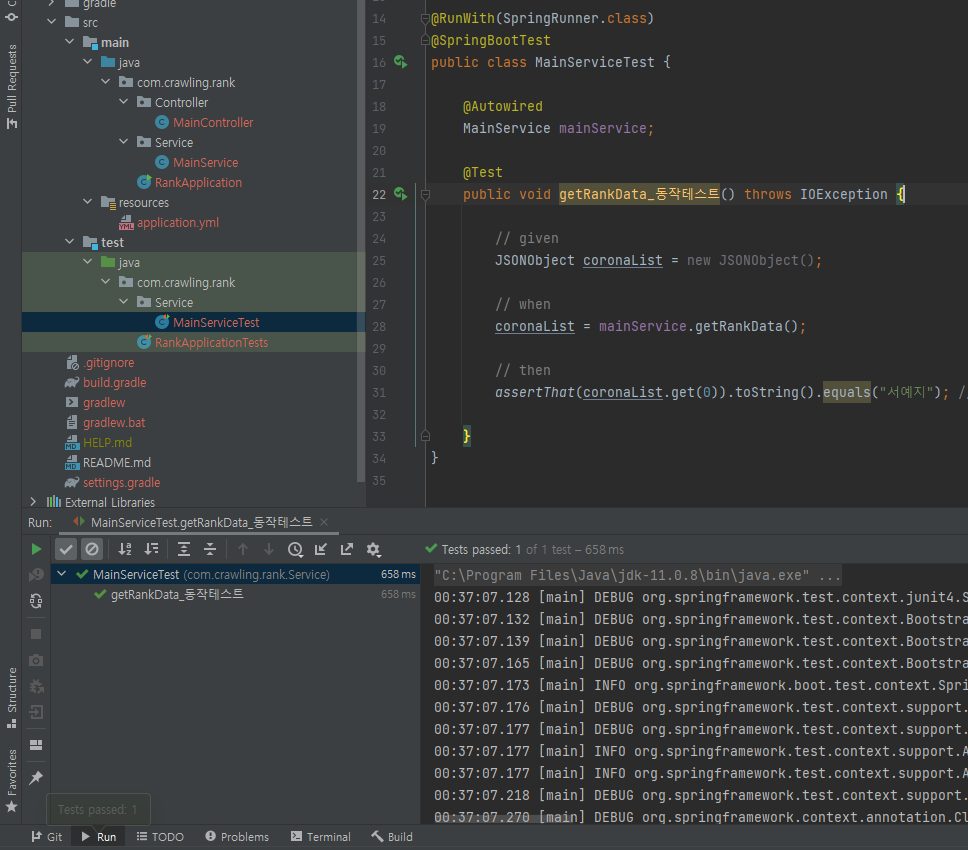
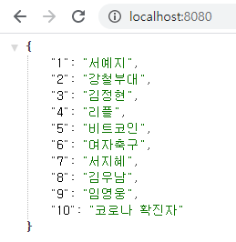

# crawling
JSoup을 이용한 크롤링


#### Jsoup

Jsoup이란 HTML을 가져오고 파싱할 수 있는 기능을 제공하는 오픈 소스 자바 라이브러리.


#### 개요

포털 사이트 zum의 실시간 이슈 검색어 크롤링


#### 개발 환경

* IntelliJ
* Spring Boot 2.4.4
* Java 11
* Gradle 6.8.3
* Windows 10


### Test Code

```java
@RunWith(SpringRunner.class)
@SpringBootTest
public class MainServiceTest {

    @Autowired
    MainService mainService;

    @Test
    public void getRankData_동작테스트() throws IOException {

        // given
        JSONObject coronaList = new JSONObject();

        // when
        coronaList = mainService.getRankData();

        // then
        assertThat(coronaList.get(0)).toString().equals("서예지"); 
        // 실시간 검색어기 때문에 테스트시 확인 필요 ( 21-04-14 00:34 기준 )

    }
}
```





#### 결과 화면


